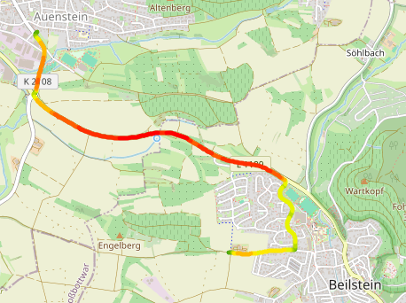

# DynamicDataSet
Test of LFS upload and usage
## Data sets

| Data Set | Description | Format | License | Contact |
| -------- | ----------- | ------- | ------ |------ |
| [car_loads.h5](https://github.com/DKreuter/DynamicDataSet/tree/5c469b03ad513e7a56c4adaeb5152e7fbbe6af54/data) | [Vibration measurement of two different cars](#car-loads) | hdf | [CC-BY-SA-4.0](https://creativecommons.org/licenses/by-sa/4.0/legalcode.txt) | DanielChristopher.Kreuter@bosch.com |
| ["car_unsprung_mass_acc.pkl"](https://github.com/DKreuter/DynamicDataSet/tree/5c469b03ad513e7a56c4adaeb5152e7fbbe6af54/data) | [Vibration measurement of the unsprung mass](#car-unsprung_acc) | pickle | [CC-BY-SA-4.0](https://creativecommons.org/licenses/by-sa/4.0/legalcode.txt) | DanielChristopher.Kreuter@bosch.com |

### Vibration measurement of two different cars -- features 
Data set contains vehicle measurement of two different cars. All data are scaled and normalized. The measurement is split in time steps. Every row contains the data of this time step. 
- Labels: Descriptors of the acceleration of the undamped mass (e.g. min, max, std)
- Features: vehicle speed, street roughness, ...

|     | amax         | amin         | std                  | kurtosis              | skew                 | speed                | AVG_IRI | ROUTE_TYPES | URBAN | BRIDGE | car |
| --- | ------------ | ------------ | -------------------- | --------------------- | -------------------- | -------------------- | ------- | ----------- | ----- | ------ | --- |
| 0   | 0.092182316  | -0.030727439 | 0.034474375873403615 | -1.248572544956299    | -0.32377647814911326 | 0.059264000000000004 | 4.8     | 0.0         | 1.0   | 0.0    | B   |
| 1   | 0.092182316  | -0.061454877 | 0.031904225782007696 | -0.4145427908147341   | 1.0070682910778772   | 0.050004             | 4.8     | 0.0         | 1.0   | 0.0    | B   |
| 2   | -0.030727439 | -0.092182316 | 0.014341965511269952 | -0.014041240938921007 | -0.9282224991843611  | 0.02778              | 4.8     | 0.0         | 1.0   | 0.0    | B   |
| 3   | 0.061454877  | -0.092182316 | 0.021873665339597604 | 1.7844630674693747    | 1.5318499207812712   | 0.02778              | 4.8     | 0.0         | 1.0   | 0.0    | B   |
| 4   | 0.04096992   | -0.061454877 | 0.026342002176476125 | -0.9213735255263735   | 0.9485480204179958   | 0.05556              | 4.8     | 0.0         | 1.0   | 0.0    | B   |
| 5   | 0.030727439  | -0.061454877 | 0.01923562380743987  | 3.976726806984951     | 1.971356610418038    | 0.016668             | 4.8     | 0.0         | 1.0   | 0.0    | B   |
| 6   | 0.21509208   | -0.21509208  | 0.04804132996888621  | 1.7082873112498378    | 0.07830243066921876  | 0.016668             | 4.8     | 0.0         | 1.0   | 0.0    | B   |

### Vibration measurement of the unsprung mass 
Data set contains a acceleration measurement of a car. Sensors are placed on the unsprung mass. The dictionary contains data frames with the 

- Acceleration signals ($f_s=4096$ Hz) in x,y,z direction
- Velocity of the car
- gps data 
- street information

